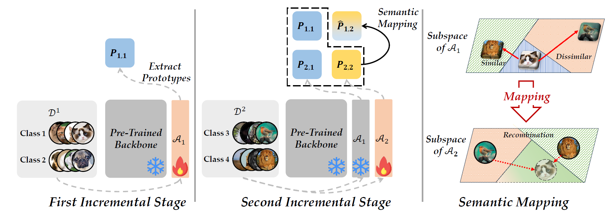
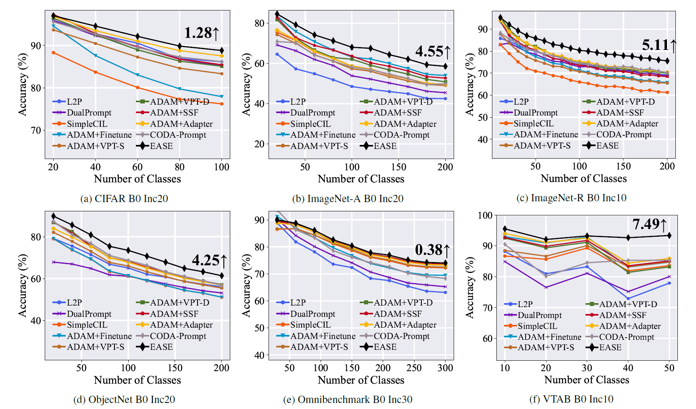
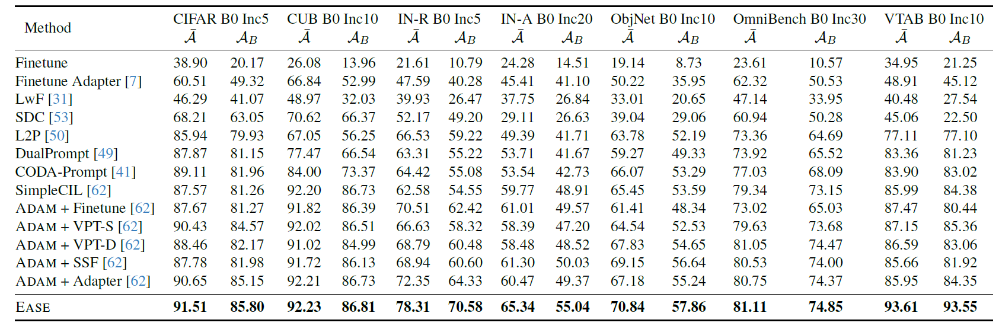

# Expandable Subspace Ensemble for Pre-Trained Model-Based Class-Incremental Learning

<p align="center">
  <a href=""></a>
  <a href='https://arxiv.org/abs/2403.12030'></a>
  <a href=""></a>
  <a href=""></a>
</p>

🎉The code repository is from the original implemenation for the paper "Expandable Subspace Ensemble for Pre-Trained Model-Based Class-Incremental Learning" [[paper]](https://arxiv.org/abs/2403.12030)(CVPR24) in PyTorch. If you use any content of this repo for your work, please cite the following bib entry of the official implementation by the authors of the paper:

```
  @inproceedings{zhou2024expandable,
    title={Expandable Subspace Ensemble for Pre-Trained Model-Based Class-Incremental Learning},
    author={Zhou, Da-Wei and Sun, Hai-Long and Ye, Han-Jia and Zhan, De-Chuan},
    booktitle={CVPR},
    pages={23554--23564},
    year={2024}
  }
```

## Expandable Subspace Ensemble for Pre-Trained Model-Based Class-Incremental Learning

Cass-Incremental Learning (CIL) presents a funda-
mental challenge in machine learning: how to accommodate new
classes while preserving knowledge of previously learned ones.
While Pre-Trained Models (PTMs) have demonstrated promising
results in CIL scenarios, they frequently struggle with catas-
trophic forgetting when adapting to new tasks. This report exam-
ines the Expandable Subspace Ensemble (EASE) framework ,
which addresses these limitations through task-specific adapter
modules that create distinct subspaces for different tasks. EASE
provides a way to make decisions by combining information from
different parts (subspaces) and uses a strategy that generates
helpful feature examples for older classes. This process doesn’t
need access to the original training data, making it efficient
and flexible. Comprehensive evaluation across seven benchmark
datasets demonstrates EASE’s effectiveness in mitigating catas-
trophic forgetting while efficiently integrating new knowledge.
The codes, outputs, logs, my implementation and other related
files are available in this repository.


## 🎊 Results

I conducted experiments on six benchmark datasets to verify the competitive performance of EASE.


This is the output of training the ViT-B/16-IN1K with EASE on CIFAR dataset. Other images are available in the `resources` directory.




The above two images are the results from the original paper.

## Requirements
### 🗂️ Environment
1. [torch 2.0.1](https://github.com/pytorch/pytorch)
2. [torchvision 0.15.2](https://github.com/pytorch/vision)
3. [timm 0.6.12](https://github.com/huggingface/pytorch-image-models)
4. [easydict](https://github.com/makinacorpus/easydict)


### 🔎 Dataset
The link for the processed datasets as follows:
- **CIFAR100**: will be automatically downloaded by the code.
- **CUB200**:  Google Drive: [link](https://drive.google.com/file/d/1XbUpnWpJPnItt5zQ6sHJnsjPncnNLvWb/view?usp=sharing) or Onedrive: [link](https://entuedu-my.sharepoint.com/:u:/g/personal/n2207876b_e_ntu_edu_sg/EVV4pT9VJ9pBrVs2x0lcwd0BlVQCtSrdbLVfhuajMry-lA?e=L6Wjsc)
- **ImageNet-R**: Google Drive: [link](https://drive.google.com/file/d/1SG4TbiL8_DooekztyCVK8mPmfhMo8fkR/view?usp=sharing) or Onedrive: [link](https://entuedu-my.sharepoint.com/:u:/g/personal/n2207876b_e_ntu_edu_sg/EU4jyLL29CtBsZkB6y-JSbgBzWF5YHhBAUz1Qw8qM2954A?e=hlWpNW)
- **ImageNet-A**: Google Drive: [link](https://drive.google.com/file/d/19l52ua_vvTtttgVRziCZJjal0TPE9f2p/view?usp=sharing) or Onedrive: [link](https://entuedu-my.sharepoint.com/:u:/g/personal/n2207876b_e_ntu_edu_sg/ERYi36eg9b1KkfEplgFTW3gBg1otwWwkQPSml0igWBC46A?e=NiTUkL)
- **OmniBenchmark**: Google Drive: [link](https://drive.google.com/file/d/1AbCP3zBMtv_TDXJypOCnOgX8hJmvJm3u/view?usp=sharing) or Onedrive: [link](https://entuedu-my.sharepoint.com/:u:/g/personal/n2207876b_e_ntu_edu_sg/EcoUATKl24JFo3jBMnTV2WcBwkuyBH0TmCAy6Lml1gOHJA?e=eCNcoA)
- **VTAB**: Google Drive: [link](https://drive.google.com/file/d/1xUiwlnx4k0oDhYi26KL5KwrCAya-mvJ_/view?usp=sharing) or Onedrive: [link](https://entuedu-my.sharepoint.com/:u:/g/personal/n2207876b_e_ntu_edu_sg/EQyTP1nOIH5PrfhXtpPgKQ8BlEFW2Erda1t7Kdi3Al-ePw?e=Yt4RnV)
- **ObjectNet**: Onedrive: [link](https://entuedu-my.sharepoint.com/:u:/g/personal/n2207876b_e_ntu_edu_sg/EZFv9uaaO1hBj7Y40KoCvYkBnuUZHnHnjMda6obiDpiIWw?e=4n8Kpy) You can also refer to the [filelist](https://drive.google.com/file/d/147Mta-HcENF6IhZ8dvPnZ93Romcie7T6/view?usp=sharing) if the file is too large to download.

You need to modify the path of the datasets in `./utils/data.py`  according to your own path.
> These datasets are referenced in the [ADAM](https://github.com/zhoudw-zdw/RevisitingCIL) 

## 🔑 Running scripts

Please follow the settings in the `exps` folder to prepare json files, and then run:

```
python main.py --config ./exps/[filename].json
```

**Here is an example of how to run the code** 

if you want to run the cifar dataset using ViT-B/16-IN1K, you can follow the script: 
```
python main.py --config ./exps/ease_cifar.json
```

if you want to run the cifar dataset using ViT-B/16-IN21K, you can follow the script: 
```
python main.py --config ./exps/ease_cifar_in21k.json
```

After running the code, you will get a log file in the `logs/ease/cifar224/` folder.

## 👨‍🏫 Acknowledgment

I would like to express our gratitude to the following repositories for offering valuable components and functions that contributed to our work.

- [PILOT: A Pre-Trained Model-Based Continual Learning Toolbox](https://github.com/sun-hailong/LAMDA-PILOT)
- [RevisitingCIL](https://github.com/zhoudw-zdw/RevisitingCIL)

I have also taken the code and modified it according to my requirements from the original repository

-[CVPR24-Ease](https://github.com/sun-hailong/CVPR24-Ease)